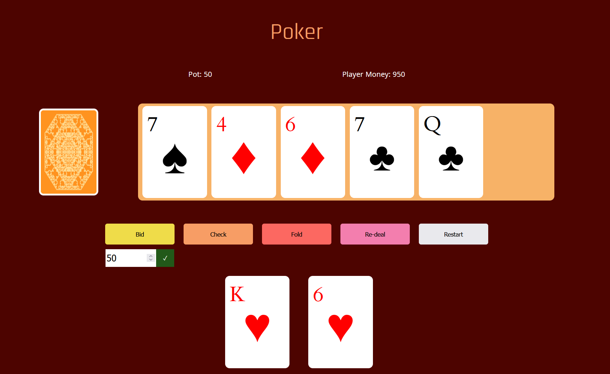

# Poker Practicing App

A 1 person poker game - getting used to card mechanics, graphics, and randomness in JavaScript. This is a personal project using JavaScript, HTML and SCSS.

## MVP

-   A system that deals two cards to a player, then deals cards to the centre in the same manner as in poker
-   Ability to fold
-   Ability to see remaining cards on fold or on check
-   Ability to redeal
-   Different coloured cards depending on the suit
-   Suit images

## Palette and Design

Many poker games online use the same green and red palette, so I decided to go against this and opted for a coral palette generated at coolors.co

In order to allow for this, I made the design for the card back on onlinefractaltools.com to imitate the complex designs that commonly appear on the backs of cards.

In addition, I opted for some darker colours to counter the more piercing effect of these colours, especially darker reddish-browns and purples.

## Updates: 18/10

-   Added ability to bet, track player money and pot.
-   Added ability to restart and reset player money
-   Refactored code to reduce repetition
-   Fixed visuals
-   Added favicon

### To Do

-   Add an 'are you sure' functionality to restart to ensure no accidental restarts
-   Figuring out what hand the player achieved
-   Enable player to set starting money amount
-   Blinds set on a timer
